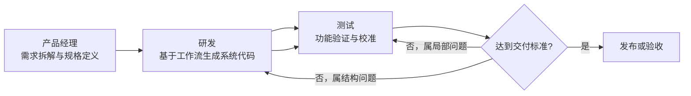

# 在 Vibe Coding 下，研发体系应该怎么分工

过去讨论研发协作 ,大多都是瀑布流和敏捷。落到执行层面，常见分工也大多是产品提需求、设计出稿、前后端开发、测试提单、研发修复。这个模式在传统手工编码时代是成立的，因为代码主要靠人一行一行写，研发天然是唯一的实现中心。

但在 Vibe Coding 语境下，这个前提已经变了。现在很多项目的主要矛盾，不再是“谁来写第一版代码”，而是“谁来把 AI 生成的系统持续拉到可交付状态”。第一版能很快出来，真正耗时的是后面的反复修正、对齐、补洞、验收和交付。

如果组织分工还停留在旧模式，就会出现一个典型问题：AI 把产出速度抬高了，但团队协作链路没有缩短，反而因为沟通往返太多，把效率又吃回去了。

所以我更倾向于把 Vibe Coding 下的研发体系拆成三个阶段：设计、实现、校准。

## 设计 -> 实现 -> 校准

### 设计

设计阶段的核心任务不是“画页面”，而是把需求压缩成 AI 和人都能稳定执行的输入。包括功能规格、页面结构、交互规则、异常场景、数据口径、验收标准。

这个阶段更适合产品经理主导。因为产品经理本来就最接近业务目标，最清楚系统要解决什么问题、优先级如何排、哪些地方不能错。Vibe Coding 里，设计做得越清楚，后面实现和校准阶段的随机性就越低。

### 实现

实现阶段的核心任务，是基于功能规格、UI 说明和业务工作流，生成整个系统的代码，包括前后端功能、页面、接口、数据流转以及主要业务逻辑，并让系统整体跑起来。

这一步更适合研发主导。原因很简单：虽然 AI 能生成大量代码，但项目结构、技术选型、模块边界、数据流组织、异常兜底方式，仍然需要工程判断。研发的价值不只是“写代码”，而是决定代码应该长成什么样，哪些结构以后不会拖死团队。

### 校准

校准阶段的核心任务，是围绕“可交付”持续迭代。包括功能测试、缺陷复现、提示词修正、局部代码调整、体验补齐、文案打磨、边界问题清理，以及回归验证。

这一阶段完全可以让测试主导。因为校准本质上不是重新设计系统，而是在既有结构上持续发现偏差、描述偏差、修正偏差。它和传统测试提 bug 的工作流高度相似，只是从“把问题转给研发”变成“直接与 AI 协作把问题收掉”。

## 为什么要把“校准”单独拆出来

1. 校准通常耗时比较长，因为 AI 生成的内容有随机性，需要进行功能测试。如果按照正常流程推进，一般是测试提 bug，然后研发修改，测试再验证。相比之下，不如让测试直接进行 vibe coding，在发现 bug 的同时直接优化问题，这样可以减少相互之间的沟通，从而提高效率。

2. 校准时的对话方式，其实和提 bug 的风格差不多，都是描述功能缺陷，因此也比较适合测试岗位来承担。

3. 校准这部分对代码技能的要求并不高，因为整个项目的代码和风格已经生成完成。校准一般只涉及局部改动，如果在实现阶段能够做好项目规划和内容提示文档，这部分 AI 修改的内容相对会更可控。即使 AI 把代码改坏了，也还可以找第二步的研发协助，因此并不要求具备很强的代码能力。

4. 从对代码的把握程度来看，通过 AI 生成的代码，对于研发本人来说，其实熟悉程度也未必很高。既然如此，交给其他人去修改，和自己修改相比，差别也没有那么大，因此完全可以通过分工把这部分工作交给其他岗位。

## 协作流程

可以把整个流程理解成一条连续的数据流，而不是三段互相甩锅的工序：

产品经理先负责拆解需求，明确功能规格、页面形态和业务工作流，把系统“应该做成什么样”定义清楚；研发再基于这些输入，生成整个系统的代码，把前后端功能、页面、接口和主要业务逻辑整体落地；测试拿到可运行系统后，围绕功能正确性、交互体验和边界场景进行验证，并在校准阶段直接结合 AI 持续优化问题。

## 三个阶段分别做什么

### 一、设计阶段：把模糊需求变成稳定输入

设计阶段的目标，不是追求文档好看，而是降低后续生成的不确定性。

产品经理在这个阶段至少要产出下面几类内容：

- 功能规格说明：模块目标、业务规则、输入输出、异常处理
- HTML 格式的 UI 图：把页面结构、关键状态、交互路径、提示文案直接做成可预览的前端原型
- 页面与交互说明：页面结构、关键流程、状态变化、提示文案，以及每个页面对应的 UI 原型说明

这里要额外强调一点：设计阶段传递到实现阶段时，怎么保证生成出来的系统真的是产品经理想要的，关键在于设计阶段就先生成 HTML 格式的 UI 图。产品经理先确认这套 UI 原型，研发在工作流中也能通过html格式的UI作为生成页面的参考，AI跑偏的概率会明显下降。

### 二、实现阶段：基于 spec-kit 工作流生成整个系统代码

实现阶段的目标，是让系统从需求说明和 UI 原型，进入一条受约束的生成流水线，最后产出完整可运行的软件系统。

这个阶段本质上不是直接让 AI 开始写代码，而是先把“系统该怎么生成”这件事流程化。强调的是 spec-driven development，也就是先把规格、约束、计划和任务链路立住，再进入实现。

这条工作流可以理解成六步：

- `/speckit.constitution`：先定义项目宪章，明确哪些原则不能碰，比如架构边界、命名规则、质量门槛、兼容性要求
- `/speckit.specify`：把需求整理成结构化规格，明确用户故事、功能边界、验收标准
- `/speckit.clarify`：把模糊点提前问清楚，尽量在写代码前消灭歧义
- `/speckit.plan`：基于规格生成实现计划，把模块结构、技术方案、数据与接口约束写清楚
- `/speckit.tasks`：把计划拆成独立任务，让后续实现和校准都知道每一块的边界在哪里
- `/speckit.implement`：最后才进入代码生成与实现，把前面冻结下来的内容真正落地

这套流程的关键价值，在于把“提示词”从一次性对话，变成一组可继承的工程文档。以前常见的问题是，研发跟 AI 聊完一轮，代码虽然出来了，但设计依据没有沉淀，后面测试只能继续靠聊天猜上下文；而在 spec-kit 里面，前面的 constitution、spec、plan、tasks 都会变成后续实现和校准都能反复引用的输入。

从实现阶段传递到校准阶段时，可以把后续校准所需的“修改边界”和“提示上下文”先固定下来，避免测试在校准时越改越偏。这里比较稳妥的方法，就是把 spec-kit 工作流接进来，把 constitution 作为总约束，再通过 `spec / plan / tasks` 以及 plan 阶段沉淀出的设计文档，把系统的目标、结构、接口和任务边界提前写实。

### 三、校准阶段：把能跑的系统变成交付品

校准阶段的目标，是把“基本能用”推进到“稳定可交付”。

校准阶段之所以能交给测试主导，不是因为测试可以随便改，而是因为研发已经在上一阶段把 prompt 的地基先铺好了。测试拿到的应该不是“一个能跑的仓库”，而是“一套能约束 AI 修改行为的完整上下文”：UI 原型、功能规格、计划文档、接口约定、任务拆分。这样校准才是在边界内收敛问题，而不是重新发明系统。

## 团队模式也会跟着变化

如果这种分工方式能够跑通，后续团队模式就不必再按传统方式平铺配置人力。相比过去 `(1 产品经理 + 1 前端&后端开发 + 1 测试)` 这种一条线配一套人的方式，新的模式可以收敛成 `2 个产品经理 + 1 名前端&后端开发 + 8 个测试`。重新组织协作关系。

这里面团队还是需要1 名前端和后端开发工程师，作为技术指导者。核心工作是确定技术选型、项目结构、代码约束、生成策略和公共能力，提前把 AI 生成代码的边界框住；当测试在校准阶段遇到结构性问题、跨模块问题或生成质量失控的问题时，再由这个核心开发介入处理。换句话说，研发从“生产主力”转成“技术中枢”。

测试则是这套模式里真正承担并行推进的人。他们拿到规格、工作流和初始系统后，可以按模块、按页面、按业务流程并行展开校准：一边验证功能，一边和 AI 协作修正局部问题，一边持续回归，直到把各自负责的部分拉到可交付状态。这样，团队的并行能力主要来自测试侧，而不是像过去那样完全压在研发侧。

在这套模式下面, 1产品经理+1开发的效率完全可以托住4个测试  可以同时 进行8 条小流水线，如果这条链路能够稳定运行，那么它的组织效率就有机会接近甚至超过过去 `8 * (1 产品经理 + 1 前端/后端开发 + 1 测试)` 的传统开发模式。

## 最后

Vibe Coding 时代，最值得强调的，其实不只是“AI 让写代码变快了”，而是生产力已经变了。过去软件研发的生产力，主要取决于研发个人的编码速度和团队的人力堆叠；现在 AI 直接把代码生成能力抬高了一个数量级，很多原来要靠多人逐步完成的实现工作，已经可以通过工作流和提示体系快速生成。

但不意味着结果自然会变好。真正决定这波能力能不能释放出来的，是生产关系有没有跟着变。团队怎么分工、怎么协作、怎么回流、谁对什么结果负责。如果还沿用过去那种一条需求线配一套产品、研发、测试的小团队模式，那么 AI 带来的生成效率，最后很可能还是会被沟通成本、返工成本和职责割裂吃掉。

而是当生产力发生跃迁之后，生产关系必须一起调整。谁能先把这套关系重新组织好，谁的 Vibe Coding 才不是演示，不只是“能生成代码”，而是真正形成稳定的生产力。